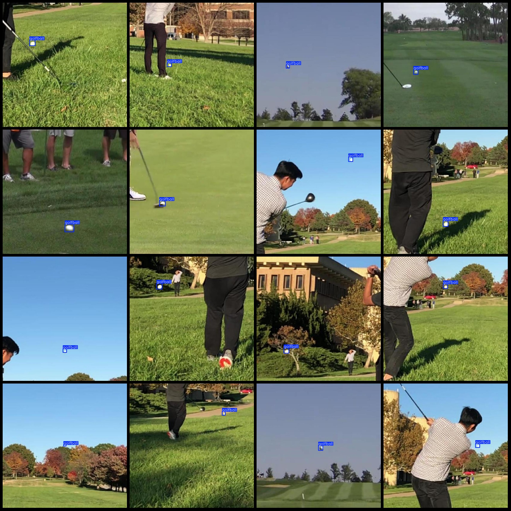

# Golfball Detection Dataset: VOC+YOLO (Pascal VOC + YOLO)

The dataset format is Pascal VOC format plus YOLO format (without the split path in the txt file, only containing the jpg images and corresponding VOC format xml files and yolo format txt files).

Number of images (jpg file count): 9489
Number of annotations (xml file count): 9489
Number of annotations (txt file count): 9489
Number of annotation categories: 1
Annotation category name: ["golfball"]
Number of boxes per category:
Golfball boxes = 9489
Total boxes: 9489
Number of images per category:
Golfball images = 9489
Image resolution: 640x640
Annotation tool used: labelImg
Annotation rules: draw boxes for each category
Important note: The dataset does not have a training/validation/test split. You need to divide it yourself.
Special statement: This dataset does not guarantee the accuracy of the trained models or weight files.
Image preview:
Annotation example:

## Images

Here is a pay link on Stripe ( https://buy.stripe.com/3cs8yP7sY87d0vu9AB ). Please contact me lonlonago@foxmail.com after funding $89, and I will send you a complete data files , thank you!

